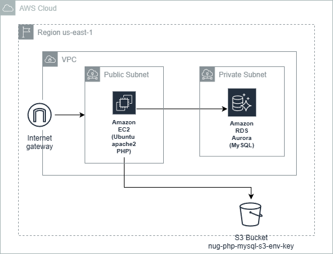
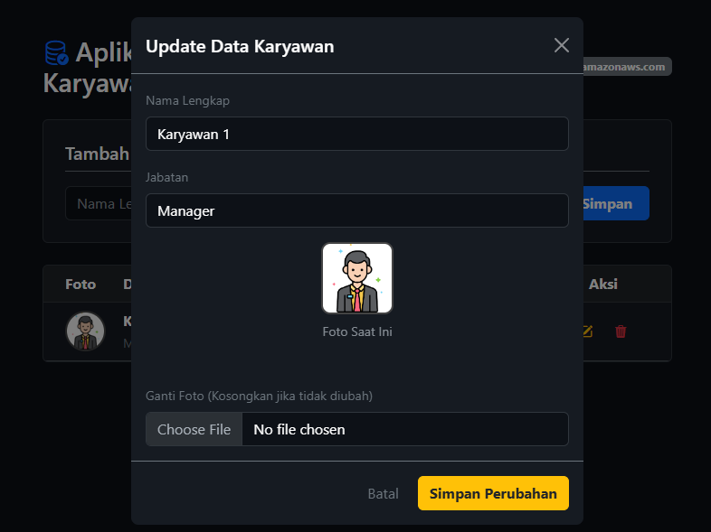

## Serverless Elastic Beanstalk (PHP), RDS (MySQL), dan S3 untuk Aplikasi Stock Barang TOKO ORANGE dengan S3 SDK (tanpa Key, tanpa Secret, tanpa Token) 
#### Menggunakan solusi Serverless  Elastic Beanstalk di lingkungan **AWS Academy**.
---



---

## I. Persiapan Infrastruktur AWS

Buat dulu SG yang sesuai, ijinkan inbound rule port 22, 80 (web server), dan 3306 (MySQL/Aurora) dari anywhere-IPv4 (0.0.0.0/0).

---

### A. Buat RDS

1. Buka Aurora and RDS
2. Klik create database
3. Choose a database creation method : Full Configuration
4. Engine type : MySQL
5. Templates : Sandbox
6. Availability and durability : otomatis terpilih Single-AZ DB instance deployment (1 instance)
7. DB instance identifier : database-1
8. Master username : (admin) boleh diganti
9. Credentials management : Self managed
10. Master password : (P4ssw0rd) boleh diganti
Confirm master password : (P4ssw0rd) boleh diganti


11. Public access : No, kalau butuh diakses dari luar buat jadi Yes
12. VPC security group (firewall) : Choose existing, pilih yang sudah dibuat tadi
13. Klik create database
14. Tunggu sampai mendapatkan End Point

---

### B. Membuat dan Konfigurasi S3 Bucket
S3 Bucket dapat dibuat dengan Web GUI Management Console seperti biasa, 


## Buat S3
1. Buka Amazon S3 (cari S3)
2. Klik Create bucket 
   - Bucket Type : General purpose
   - Bucket Name : nug-php-mysql-s3-env-key
   - Object Ownership
        - bebas pilih : <h2> ACLs disabled </h2> atau <h2> ACLs enabled </h2>
   - Block Public Access settings for this bucket
   - pastikan Block all public access TIDAK DICENTANG
   - jangan lupa CENTANG acknowledge that the current settings
3. klik Create bucket

---

## II. Deploy App ke Serverless ELastic Beanstalk

### Persiapan
### 1. Unduh file dari repo https://github.com/paknux/serverless-php-mysql-s3-env-key.git
3 file utama yang diperlukan: 
- index.php
- composer.json
- .env

### 2. Edit Environment Variable .env
Environment variable dapat berupa file .env atau dapat merupakan environment dari OS. Editlah file .env dengan aplikasi text editor, sehingga memuat hal berikut ini:

### .env
````
DB_HOST=database-1.ccqnofwkwmzs.us-east-1.rds.amazonaws.com
DB_PORT=3306
DB_NAME=db_karyawan
DB_USER=admin
DB_PASS=P4ssw0rd

AWS_REGION=us-east-1
AWS_BUCKET=nug-php-mysql-s3-env-key
````


### 3. Zip (compress) 3 file terebut
Kompress 3 file tersebut menjadi .zip. Harus .zip. tidak boleh .rar ata format kompresi yang lain
misal menjadi app.zip


---

## III. Pengujian
##### Gunakan browser
````
http://ip_public
````



---

## IV. Pengembangan
1. Menggunakan User Data yang akan dieksekusi pada saat pertama kali pembuatan instance EC2
2. Jika menjadi kebijakan perusahaan (untuk penghematan dll),  mungkin perlu memasang Server MySQL (instance EC2) sendiri 
3. Menggunakan solusi Serverless (Elastic Beanstalk) untuk mendeploy PHP
4. Menggunakan Lambda dan API Gateway (migrasi ke bahasa pemrograman lain seperti Node.js)
5. Menggunakan CloudFormation (yaml) untuk membuat stack automation
