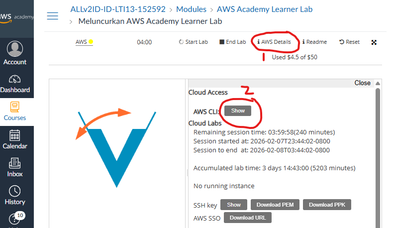

## Serverless Elastic Beanstalk (PHP), RDS (MySQL), dan S3 untuk Aplikasi Data Karyawan dengan Environment Variable dan S3 Key 
#### Menggunakan solusi Serverless  Elastic Beanstalk di lingkungan **AWS Academy**.
---


---

## I. Persiapan Infrastruktur AWS

Buat dulu SG yang sesuai, ijinkan inbound rule port 22, 80 (web server), dan 3306 (MySQL/Aurora) dari anywhere-IPv4 (0.0.0.0/0).

---

### A. Buat RDS

1. Buka Aurora and RDS
2. Klik create database
3. Choose a database creation method : Full Configuration
4. Engine type : MySQL
5. Templates : Sandbox
6. Availability and durability : otomatis terpilih Single-AZ DB instance deployment (1 instance)
7. DB instance identifier : database-1
8. Master username : (admin) boleh diganti
9. Credentials management : Self managed
10. Master password : (P4ssw0rd) boleh diganti
Confirm master password : (P4ssw0rd) boleh diganti


11. Public access : No, kalau butuh diakses dari luar buat jadi Yes
12. VPC security group (firewall) : Choose existing, pilih yang sudah dibuat tadi
13. Klik create database
14. Tunggu sampai mendapatkan End Point

---

### B. Membuat dan Konfigurasi S3 Bucket
S3 Bucket dapat dibuat dengan Web GUI Management Console seperti biasa, 


## Buat S3
1. Buka Amazon S3 (cari S3)
2. Klik Create bucket 
   - Bucket Type : General purpose
   - Bucket Name : nug-php-mysql-s3-env-key
   - Object Ownership
        - pilih : <h2> ACLs enabled </h2>
   - Block Public Access settings for this bucket
   - pastikan Block all public access TIDAK DICENTANG
   - jangan lupa CENTANG acknowledge that the current settings
3. klik Create bucket

---

## II. Deploy App ke EC2

## Langkah 1: Persiapan dan Instalasi Server
Jalankan perintah berikut pada terminal EC2 Ubuntu 24.04 untuk menginstal Apache, PHP, dan dependensi lainnya:

```bash
# Update sistem
sudo apt update

# Install Apache, PHP, dan ekstensi yang diperlukan
sudo apt install -y apache2 php-mysql php php-cli php-curl php-xml php-mbstring libapache2-mod-php unzip composer

# Bersihkan direktori web dan Clone Repo
rm -rf /var/www/html/*
git clone https://github.com/paknux/php-mysql-s3-env-key.git /tmp/repo
cp -r /tmp/repo/* /var/www/html/
rm -rf /tmp/repo

# Install AWS SDK for PHP di direktori project
cd /var/www/html
composer require aws/aws-sdk-php vlucas/phpdotenv

# Atur izin folder agar web server bisa menulis file
sudo chown -R www-data:www-data /var/www/html
sudo chmod -R 777 /var/www/html

# Hapus index.html
sudo rm /var/www/html/index.html
```

## Langkah 2: Setting Environment Aplikasi

## Environment Variable .env
Environment variable dapat berupa file .env atau dapat merupakan environment dari OS. 
Untuk aplikasi Apache2-PHP karena user yang menjalankan adalah www-data maka lebih mudah digunakan file .htaccess atau .env di dalam direktori kerja /var/www/html

`````
nano /var/www/html/.env
`````

Isi dari file .env memuat hal berikut ini:

````
DB_HOST=database-1.ccqnofwkwmzs.us-east-1.rds.amazonaws.com
DB_PORT=3306
DB_NAME=db_karyawan
DB_USER=admin
DB_PASS=P4ssw0rd

AWS_REGION=us-east-1
AWS_BUCKET=nug-php-mysql-s3-env-key

AWS_ACCESS_KEY_ID=
AWS_SECRET_ACCESS_KEY=
AWS_SESSION_TOKEN=
````
AWS_ACCESS_KEY_ID, AWS_SECRET_ACCESS_KEY, AWS_SESSION_TOKEN dapat dilihat dari AWS Details di akun AWS Academy anda, di halaman untuk Start Lab / End Lab.




---

## III. Pengujian
##### Gunakan browser
````
http://ip_public
````


##### Pengetesan Environment Variable
````
http://ip_public/testenv.php
````


---

## IV. Pengembangan
1. Menggunakan User Data yang akan dieksekusi pada saat pertama kali pembuatan instance EC2
2. Jika menjadi kebijakan perusahaan (untuk penghematan dll),  mungkin perlu memasang Server MySQL (instance EC2) sendiri 
3. Menggunakan solusi Serverless (Elastic Beanstalk) untuk mendeploy PHP
4. Menggunakan Lambda dan API Gateway (migrasi ke bahasa pemrograman lain seperti Node.js)
5. Menggunakan CloudFormation (yaml) untuk membuat stack automation
